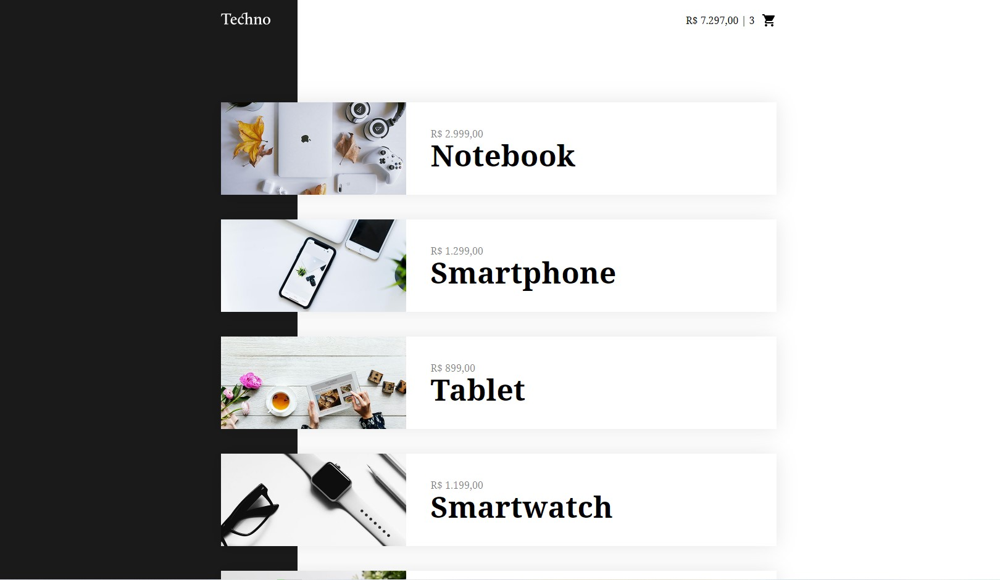
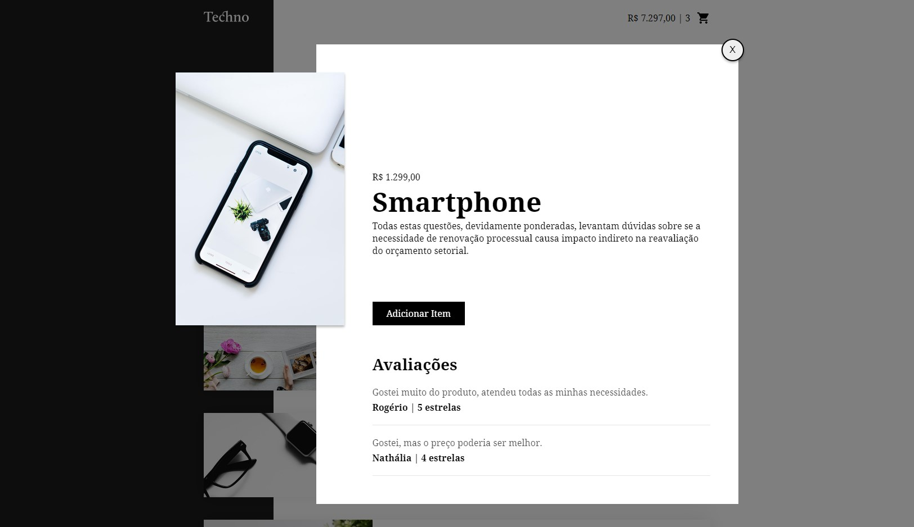

<div>
  <h1 align="left">
    Techno Shop
  </h1>
Front-end by technology e-commerce.
</div>

<h1 align="center">
  <p align="center" display="flex">
    
     
  </p>
</h1> 

<h1 align="center">
  <p display="flex">
    
    
  </p>
</h1>


## Table of contents
* [General info](#general-info)
* [Technologies](#technologies)
* [Setup](#setup)
* [Status](#status)
* [Final Considerations](#final-considerations)

## General Info
This website was create with purpose to review concepts about vue and figure out how works the framework.
I didn't use vue cli, because I would wanted build structure manually.

It's possible to simulation addition and remotion of items in shop cart.

## Technologies
Project is created with:

* HTML5
* JavaScript
* CSS3
* Vue.js v2.6.6
* local API

## Setup
To run this project in local is necessary has node.js and npm. Then you'll have to install live server: 

```
$ npm install -g live-server
```
Open the file and run live server:

```
$ live-server
```

## Status

Project is: finish, but if I have any inspiration I will add.

## Final considerations

Any feedback is welcome.

<hr> <p align="center"> I hope you enjoy 😎</p>
